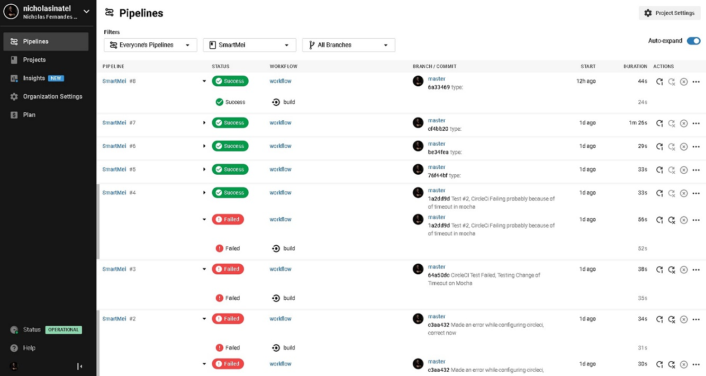

# Projeto Smart Mei Web App

Decidi executar o projeto com a seguinte Stack:

- Node
- GraphQL
- Apollo Server
- MongoDb & Mongoose

Faz tempo que gostaria de aprender essa tecnologia e me pareceu a oportunidade perfeita, este é o repositório final, eu criei outros 3 para testes e aprendizado mas que consistiam de partes da solução de forma desconexa.

## Setup & Run

| Tecnologia |      Versão       |
| :--------: | :---------------: |
|  Node.js   | 12.8.4 lts/erbium |
|    NPM     |      6.14.6       |

1. Clonar este repositório
2. `npm install`
3. `npm test`
4. `npm start`

Para o banco de dados foi utilizada a solução em nuvem MongoDb Atlas, todos os IP´s de entrada estão liberados, portanto não é necessário nenhuma configuração.

Ao realizar o `npm test` insere-se informações de exemplo no MongoDb. Os teste unitários e de integração do Mocha, são feitos de forma que sempre exista um mínimo de informações no banco. Alguns testes você irá perceber que estão fazendo 2 testes em 1.

Por exemplo a criação de usuário por teste, se o usuário já existir, ele espera que a mensagem de erro da validação correta seja enviada. Se o usuário não existir ele cria o usuário.

## Testes

São 2 Formas de Testar

1. Executar os testes automatizados criados pro npm scrips, sendo eles:

   - npm test: Mostra logs apenas da test suite
   - npm run test-full: Mostra logs da test suite e da app
   - npm run test-user: Logs test suite relacionados aos usuarios
   - npm run test-book: Logs test suite relacionados aos livros
   - npm run test-loan: Logs test suite relacionados a empréstimo e retorno de livros
   - npm run test-query: Logs test suite relacionados a queries

2. Testes salvos no postman
   - https://www.getpostman.com/collections/27c8ed43ecd660d635e0

### CI/CD

Configurei uma Pipeline na CircleCI: https://app.circleci.com/pipelines/github/nicholasinatel/SmartMei

No entanto, não descobri um jeito de compartilhar, nem gerar algum tipo de relatório, então aqui está um print comprovando:

## Regras de negócio

|       Feature       |                        Detalhe                        | Validação |  Resolver  | Obs |
| :-----------------: | :---------------------------------------------------: | :-------: | :--------: | :-: |
|  Cadastrar Usuário  |                Email único no sistema                 |    OK     | createUser |     |
|   Emprestar Livro   | Apenas um empréstimo por livro de um usuário por vez. |    OK     |  lendBook  |     |
|   Devolver Livro    |          Livro só pode ser devolvido uma vez          |    OK     | returnBook |     |
| Detalhes de usuário |    Não precisa guardar histórico de de empréstimos    |    OK     | query user |     |

> Valor input loggedUserId representando id do usuário logado, por simplificação de case, para não ter que implementar autenticação e etc..., Ficou parametrizável.

## Requisitos Técnicos Obrigatórios

|        Requisito        |                                             Observação                                              |                            Estado                            |
| :---------------------: | :-------------------------------------------------------------------------------------------------: | :----------------------------------------------------------: |
|    Disponível em Git    |                                        Github \|\| Bitbucket                                        |                              OK                              |
|       Tecnologia        |                                       Node, TypeScript ou Go                                        |                      Node.js e GraphQL                       |
|         Testes          |                                           Focarei em TDD                                            |                              OK                              |
|      Base de dados      |                 Local ou Remota, contanto que o acesso e setup estejam documentados                 |                              OK                              |
|  Documentação Simples   |                               Execução do App e Testes, passo-a-passo                               |                              OK                              |
| Utilizar Teste SmartMei | https://documenter.getpostman.com/view/7660896/SzzrZaU2 Provavelmente vou refazer isso pra GraphQl. | Criei testes automatizados e exportei uma coleção do Postman |

## Requisitos Técnicos Recomendados

|        Requisito         |                      Observação                       |                         Estado                          |
| :----------------------: | :---------------------------------------------------: | :-----------------------------------------------------: |
| Mais de um tipo de teste |                     Unitário e ?                      | Testes no Schema e Resolvers utilizando Mocha e Postman |
|       Usar commits       |                                                       |                           OK                            |
|   Documentar o código    |           Para ajudar na revisão da empresa           |                           OK                            |
|        Validação         |       Validar de forma mais rigorosa os inputs        |                           OK                            |
|          CI/CD           | Pipeline de CI/CD configurado, provavelmente CircleCI |                           OK                            |

## Referências

Documentação usada para criar a aplicação

1. https://mochajs.org
2. https://github.com/EasyGraphQL/easygraphql-tester
3. https://www.apollographql.com/docs/apollo-server/testing/testing/
4. https://www.apollographql.com/docs/tutorial/introduction/
5. https://www.apollographql.com/docs/apollo-server/getting-started/
6. https://thenewstack.io/automatic-testing-for-graphql-apis/
